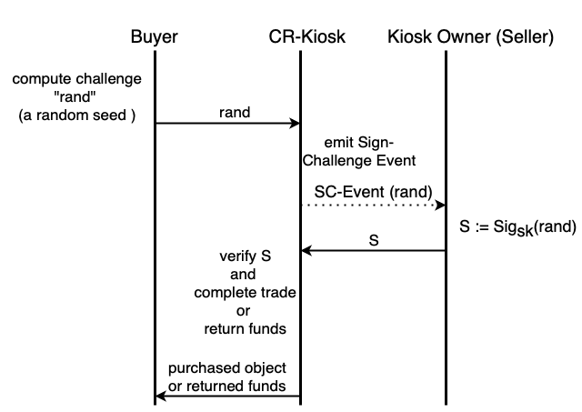

# Challenge_Response_Kiosk

Extending SUI's Kiosk for a challenge response protocol.

The necessity to have such an extension arose during the [SUIxBSA hackathon](https://sui-bsa-hackathon.devfolio.co/projects) at EPFL, when we were building the [SuiSeal](https://github.com/TUM-Blockchain-Club/SuiSeal) Application. 
This is a polished version of the hackathon implementation.

### DISCLAIMER
This is not a production ready tested, audited or formally verified version. Use at your own risk. 

## How it works
We adapt the classical kiosk interface to support a challenge reponse protocol. Which means, that basically everything is the same with a few twists in a few (partly new) functions, we're going to explian in the [functions section](#functions).

To give an intuitive overview of how it works:\
The buyer call's `purchase` with the random challenge "rand" (so to say, sends rand to the kiosk). The kiosk upon recieving the purchase request from the buyer emits an event to let the seller (kiosk-owner) know, that someone wants to buy his item and he thus needs to sign their challenge. Once the seller signed the challenge, he sends the obtained signature back to the kiosk. The kiosk checks wether the signature is actually correct and if so, completes the trade or otherwise returns the buyers funds to them. 

## Functions

We adapt the classical kiosk interface to support a challenge reponse protocol. Which means, that basically everything is the same with a few twists in a few (partly new) functions, we're going to explian  now.

`list` has the same purpose as in the classical kiosk, but expects one more parameter, the public key "pk", for the item that is listed.  

`purchase` has the same purpose as in the classical kiosk, but expects one more parameter, the challenge "rand".  Moreover, purchase, in contrast to the classical kiosk, cannot complete the trade on it own, but emits an event to let the seller (kiosk owner) know that he has to solve the challenge (once the challenge is solved by the seller, the kiosk automatically completes the trade).

`submit_sig` is a new function. It's purpose is verify that the challenge was in fact solved and complete the trade upon that or refund the buyer.

`pull_out` is a new function. It's purpose is to give the buyer the possibillity to withdraw their purchase request. 
Hence the funds cannot get stuck if the seller just does not respond, the buyer can simply pull_out.

`is_purchasable` is a new function. It's purpose is to check wether an item can actually be purchased, or if the item was already challenged by another buyer, who waits for verification, and thus it cannot be purchased at the moment.

## How do adapt

The cryptographic pirimitve behind the challenge-reponse protocol is capsulated in the 'verificator.move' file. The standard implementation comes with ed25519 sigantures (i.e. buyer challenges with a random seed and seller solves the challenge by signing the random seed with the object specific private key). However, this cryptographic primitve can be changed to virtually everything (for example to accept zk-proofs, which proof computation that would be too much to compute on chain), one would only need to exchange the verificator.move file. 
